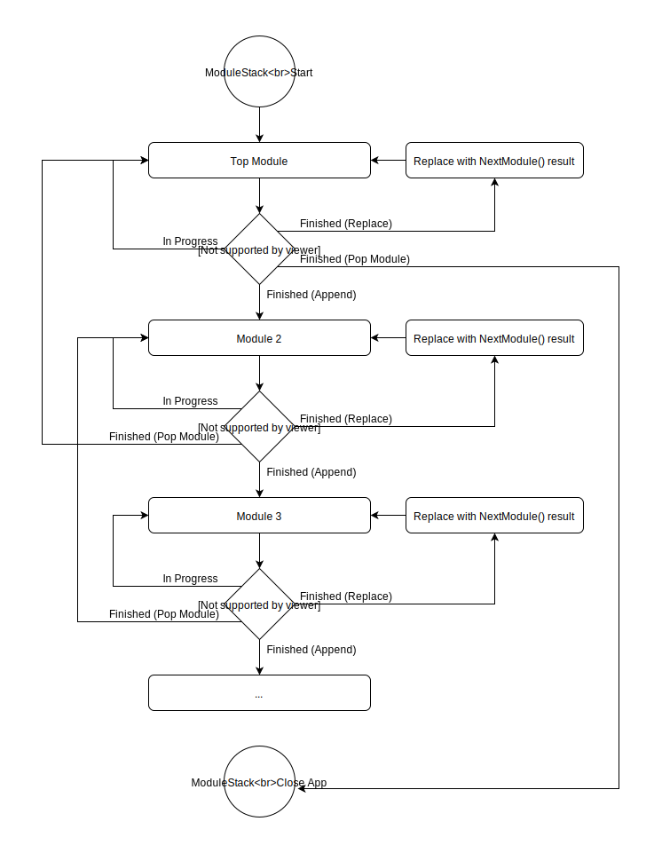

*******
Modules
*******
Modules represent a current state of the application, from what 
would be the initial welcome screen to a page in a food ordering 
application.

Module Creation
---------------
Modules are created by inheriting from the base module class 
:doc:`../../Classes/libmrhab_Directory/Module/MRH_Module`. 
This base class defines all virtual functions to overwrite and 
then calls the created module functions with the help of 
polymorphism.

Creating a module requires a module name to be used. This module 
name is currently only used for module exceptions and can be 
chosen freely (as long as the string size is greater than 0).

A custom module should inherit from the :doc:`../../Classes/libmrhab_Directory/Module/MRH_Module` 
class using the **public** access parameter.

.. code-block:: c

    class MyModule : public MRH_Module
    {
    public:
    
        MyModule() : MRH_Module("MyModule")
        {

    ...
    

Event Handling
--------------
The currently active module recieves event by callback, which calls 
the :doc:`../../Functions/libmrhab_Directory/Module/MRH_Module/CanHandleEvent` 
and :doc:`../../Functions/libmrhab_Directory/Module/MRH_Module/HandleEvent` 
function of the module.

The :doc:`../../Functions/libmrhab_Directory/Module/MRH_Module/CanHandleEvent` 
function is used to check if a callback should even happen. It gives the module 
the event type id and expects an answer if the event should be recieved.

.. code-block:: c

    bool CanHandleEvent(MRH_Uint32 u32_Type) noexcept override
    {
        switch (u32_Type)
        {
            // Valid events...
            
            // Not handled by this module
            default:
                return false;
        }
    }
    

Both the module and the event will be added to the callback thread pool 
if the event can be handled. This will then cause the module function 
:doc:`../../Functions/libmrhab_Directory/Module/MRH_Module/HandleEvent` 
to be called once the thread pool is able to perform the callback.

**A Module might already be switched when the callback occurs if the 
callbacks before it took a long time.**

.. code-block:: c

    void HandleEvent(const MRH_EVBase* p_Event) noexcept override
    {
        switch (p_Event->GetType())
        {
            // Handle event by type with event_cast<Type>(p_Event)->...
            
            // Not handled by this module
            default:
                return;
        }
    }
    

Module Updating
---------------
Modules offer a function for updating them, allowing them to perform actions:
:doc:`../../Functions/libmrhab_Directory/Module/MRH_Module/Update`. The time 
at which the module update is called depends on the way the application 
implements the library update function, but should be called after recieving 
the last event to be handled.

The module update function can then be used to process recieved event data 
and perform other actions. Events generated by modules should be added to 
the event storage singleton class :doc:`../../Classes/libmrhab_Directory/MRH_EventStorage` 
for easy event access when sending events.

Each module update has to return the current state of the module. The 
:doc:`../../Enumerations/libmrhab_Directory/Module/MRH_Module/Result` returned 
defines how the module stack will continue going forward (appending a module 
after the current module, replacing the current module, keep updating the current 
module, etc.).

.. code-block:: c

    MRH_Module::Result Update() override
    {
        // Do something
        
        // ...
        
        MRH_EventStorage::Singleton().Add(MRH_U_AVAIL_U()); // The event addition
        return MRH_Module::IN_PROGRESS; // Keep updating this module
    }
    

Switching Modules
-----------------
Every MRH application using modules can switch to other modules in either a 
sequential fashion oder by completely replacing the module with a different one.
The behaviour is decided by the :doc:`../../Enumerations/libmrhab_Directory/Module/MRH_Module/Result` 
returned by the :doc:`../../Functions/libmrhab_Directory/Module/MRH_Module/Update` 
function.

   
   
Appending modules allows the application to create a path deep inside the application. 
This method should be used if a application wants to mirror behaviour like the app 
flow found in smartphone applications with views (think SwiftUI navigation views).

The current module can also be replaced instead of appending the following module. 
This allows for hard switches in the application flow.

Poping a module always returns to the module coming before it, allowing the application 
to return to the previous module which was used to append the module popped. **Popping a 
module which replaced a module instead of appending to it will return to the module which 
came before the replaced one. Popping the top level module returns a application close 
update result.**

The next module is retrieved by the current module itself. The next module is created 
the moment :doc:`../../Functions/libmrhab_Directory/Module/MRH_Module/NextModule` is 
called, allowing for dynamic application flow.

.. code-block:: c

    std::shared_ptr<MRH_Module> NextModule() override
    {
        // Decide on module based on current module data
        return std::make_shared<NextModule>();
    }

Module Lifetime
---------------
Modules are active and on the module stack as long as they or their children are in use.
They are destroyed by either poping the module or if it is replaced by its own 
:doc:`../../Functions/libmrhab_Directory/Module/MRH_Module/NextModule` function returned 
module.