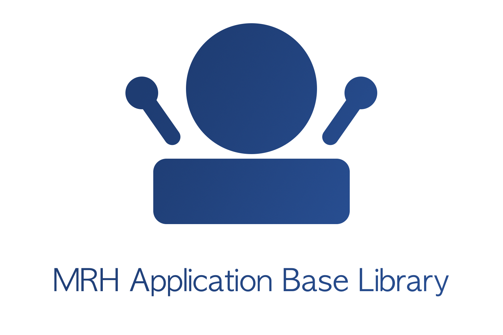

libmrhab
========

   
libmrhab is an open source library which is intended to help developing user 
applications which make use modules which are updated with a callback oriented 
design.

This documentation includes listings for the internal functions, enumerations, 
etc. used by the library itself. These are not meant to be used directly for 
application development but as information for library development.

As such, this documentation is both aimed at developers wanting to write their 
own user application service as well as library developers wishing to improve 
on the libmrhab source.

.. toctree::
   :maxdepth: 2
   :caption: Contents:

   Building/Building
   Usage/Usage
   Classes/Classes
   Namespaces/Namespaces
   Enumerations/Enumerations
   Macros/Macros
   Functions/Functions
